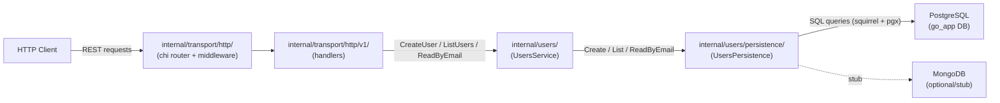

# Context Map

`go_app_template` is a self-contained HTTP service. It manages a `users` domain and exposes it via a versioned REST API. External callers are HTTP clients.

## Components

### HTTP Transport (`internal/transport/http/`)

The root `Server` wires global middleware (recovery, OpenTelemetry tracing, request logging) and mounts:
- `GET /health` — returns service status and version.
- `/api/v1` — delegated to `V1Server`.

The `V1Server` applies version-specific middleware (CORS, auth) and calls `api_gen.HandlerFromMux` to wire the auto-generated chi handler.

### V1 Handlers (`internal/transport/http/v1/`)

The `HTTP` struct implements the `ServerInterface` generated by `oapi-codegen`. Current endpoints:

| Method | Path | Handler |
|--------|------|---------|
| `GET` | `/api/v1/users` | `ListUsers` — cursor-paginated user listing |
| `POST` | `/api/v1/users` | `AddUser` — create a new user |
| `GET` | `/api/v1/users/{id}` | `FindUserByID` — stubbed (501) |

Handlers translate between HTTP request/response types (from `api_server_gen/v1`) and domain types (from `users/domain`), then delegate to `UsersService`.

### Users Service (`internal/users/`)

The `UsersService` struct holds a `UsersPersistence` dependency (injected at startup). Methods:

- `CreateUser(ctx, *domain.User)` — validates, sanitizes, persists, and returns the created user.
- `ListUsers(ctx, domain.Cursor)` — returns a cursor-paginated `UserPage`.
- `ReadByEmail(ctx, string)` — looks up a user by email.

### Persistence Layer (`internal/users/persistence/`)

The `UsersPersistence` interface is implemented by:

- `UserPostgresPersistence` — real PostgreSQL implementation using `pgxpool` + `squirrel` query builder. Uses cursor-based pagination: fetch `limit + 1` rows; expose `NextCursor` as the last row's `createdAt` if more rows exist.
- `UserMongoPersistence` — stub for a future MongoDB implementation. Returns not-implemented errors.

### Auth Middleware (`internal/transport/http/middleware/auth.go`)

`AuthMiddleware.RequireAuth()` checks for a Bearer token in the `Authorization` header or `token` query parameter. Currently uses hardcoded test tokens (`admin-token`, `readonly-token`). Sets a permission level in the request context. `RequireAdmin(r)` checks that the context permission is `admin`.

## Cross-cutting concerns

- **Observability** — Every request is traced with an OpenTelemetry span (`otelhttp.NewMiddleware`). Request logs include status code, method, path, latency, and trace ID (via `LoggingMiddleware`). Logs are structured with `log/slog`.
- **Cursor-based pagination** — `GET /api/v1/users` uses an opaque string cursor (`After`) and `Limit`. The persistence layer returns `NextCursor` (a `*string`) which the client passes as `After` on the next request.
- **Configuration** — All configuration is in `internal/configs/`. The service reads `PORT` from the environment (default `9090`) and has hardcoded Postgres credentials meant to be overridden via env vars.
- **Graceful shutdown** — The DB pool is closed via `defer pgPool.Close()` in `cmd/main.go`. A future enhancement would add SIGTERM handling with a configurable drain timeout.

## What this service is NOT

- **Not an event-driven pipeline.** It receives synchronous HTTP requests; there is no Kafka, outbox poller, or cursor store.
- **Not multi-tenant.** The users table is shared; there is no workspace or organisation isolation in the domain layer.
- **Not production-hardened auth.** The auth middleware uses hardcoded tokens. Replace with JWT or mTLS before deploying to production.
