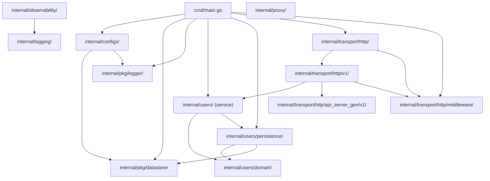

# Architecture Overview

This document is the entry point for understanding the `go_app_template` system — its structure, layers, dependency direction, and design philosophy. Every file in the repository must conform to the rules described here and in the linked documents.

## What the System Does

`go_app_template` is a Go HTTP service template. It:

1. **Exposes a versioned REST API** (`/api/v1`) generated from an OpenAPI 3.0 spec using `oapi-codegen`.
2. **Manages a `users` domain** — creating, listing, and reading users backed by PostgreSQL (with a MongoDB stub for future use).
3. **Provides operational health checks** at `GET /health`.

**Core principle: spec-driven development.** The OpenAPI spec at `api/contracts/v1/api-specs.yaml` is the source of truth for the HTTP API surface. Handler stubs are auto-generated; business logic is implemented separately. Never hand-edit generated files.

For the domain vocabulary, see the [Context Map](../domain/context-map.md) and the per-domain folders under [`harness/knowledge/domain/`](../domain/index.md).

## Design Philosophy

`go_app_template` is a **clean-architecture HTTP service**: it receives requests, delegates to a service layer, and persists via a repository pattern. Layers are organised by responsibility:

- **`cmd/`** — The process entry point. Constructs config, database pool, auth middleware, persistence, and service; wires them into the HTTP server; starts `net/http.Server`. Currently a single `main.go` using `package main`.
- **`internal/users/`** — Core domain package. Owns the `UsersService` struct, business logic (`CreateUser`, `ListUsers`, `ReadByEmail`), and domain types. Sub-packages:
  - **`internal/users/domain/`** — Domain types: `User`, `UserPage`, `Cursor`. No external dependencies.
  - **`internal/users/persistence/`** — `UsersPersistence` interface + PostgreSQL and MongoDB implementations. The only layer that imports `pgx` / `mongo-driver`.
- **`internal/transport/http/`** — HTTP transport layer.
  - **`internal/transport/http/server.go`** — Root chi router; global middleware (recovery, OTEL tracing, request logging); mounts `/health` and `/api/v1`.
  - **`internal/transport/http/v1/`** — V1 sub-router (`V1Server`), auth/CORS middleware, and handler implementations (`HTTP` struct).
  - **`internal/transport/http/api_server_gen/v1/`** — **Auto-generated** by `oapi-codegen`. Do not edit by hand.
  - **`internal/transport/http/middleware/`** — Auth, CORS, and logging middleware.
  - **`internal/transport/http/testutils/`** — Shared test harness (test server setup, request helpers).
- **`internal/api/`** — Thin legacy API wrapper (`api.go`). Health and convenience helpers. Not used by the main transport layer.
- **`internal/configs/`** — Application configuration: reads env vars and returns typed config structs for HTTP server, datastore, etc.
- **`internal/pkg/datastore/`** — Infrastructure clients: `pgxpool`-based Postgres pool (`NewPostgresService`) and MongoDB client (`NewMongoService`).
- **`internal/pkg/logger/`** — Global structured logger wrapping `go.uber.org/zap` (sugared). Exposes `Info`, `Error`, `Fatal`, etc. as package-level functions.
- **`internal/observability/`** — OpenTelemetry tracer init (`InitTelemetry`, `Shutdown`, `Tracer`) and slog integration (`InitLogger`, `ContextHandler`, `PrettyHandler`).
- **`internal/logging/`** — Pretty ANSI formatter for slog (`PrettyFormatter`, `LogEntry`, `LogLevel`).
- **`internal/proxy/`** — Thin client wrappers for external AI services (`OpenAI` proxy via `go-openai`).
- **`api/contracts/`** — OpenAPI specs (v1) for the service's HTTP API surface.
- **`internal/schemas/`** — Raw SQL DDL for Postgres tables (`users.sql`).

Core principles:

- **Spec-driven API.** Write the OpenAPI spec first, run `make generate-api-specs` to regenerate `spec.gen.go`, then implement the `ServerInterface` methods. Never hand-edit the generated file.
- **Interface-driven wiring.** `UsersService` depends on `persistence.UsersPersistence` (an interface). The concrete `UserPostgresPersistence` or `UserMongoPersistence` is injected by `cmd/main.go`.
- **Single composition root.** `cmd/main.go` is the only place that constructs concrete types and wires dependencies. Nothing outside `cmd/` calls `New*` constructors that mix layers.
- **Single binary.** `bin/app` (built via `make build`) is the only artifact.

## Repository Structure

```
go_app_template/
├── cmd/
│   └── main.go                          # Process entry point; wires all dependencies, starts HTTP server
│
├── internal/
│   ├── users/                           # Core domain: user management
│   │   ├── service.go                   # UsersService struct + NewService constructor
│   │   ├── users.go                     # Business logic: CreateUser, ListUsers, ReadByEmail
│   │   ├── users_test.go                # Unit tests for users service
│   │   ├── domain/
│   │   │   └── user.go                  # User, UserPage, Cursor types; Validate, Sanitize, SetDefaults
│   │   └── persistence/
│   │       ├── persistence.go           # UsersPersistence interface
│   │       ├── user_postgres.go         # UserPostgresPersistence (pgxpool + squirrel)
│   │       └── user_mongo.go            # UserMongoPersistence (stub)
│   │
│   ├── transport/
│   │   └── http/
│   │       ├── server.go                # Root Server: chi router, global middleware, health endpoint, v1 mount
│   │       ├── server_test.go           # Integration tests for root server
│   │       ├── api_server_gen/
│   │       │   └── v1/
│   │       │       └── spec.gen.go      # AUTO-GENERATED by oapi-codegen — do not edit
│   │       ├── middleware/
│   │       │   ├── auth.go              # AuthMiddleware, RequireAuth, RequireAdmin
│   │       │   ├── cors.go              # CorsMiddleware
│   │       │   └── logging.go           # LoggingMiddleware (slog-based request logging)
│   │       ├── testutils/
│   │       │   ├── setup.go             # SetupTestEnvironment, TestServer
│   │       │   └── helpers.go           # MakeRequest, MakeRequestWithToken, GenerateRandomToken
│   │       └── v1/
│   │           ├── server.go            # V1Server: v1 sub-router, auth/CORS middleware, RegisterHandlers
│   │           ├── user.go              # HTTP handlers: ListUsers, AddUser, FindUserByID
│   │           ├── chat.go              # Chat-related handler stubs
│   │           └── user_test.go         # Handler-level tests
│   │
│   ├── api/
│   │   ├── api.go                       # API struct: Health helper (legacy)
│   │   └── users.go                     # User-related API helpers
│   │
│   ├── configs/
│   │   └── configs.go                   # Configs struct: HTTP(), Datastore(), AppFullname()
│   │
│   ├── pkg/
│   │   ├── datastore/
│   │   │   ├── postgres.go              # NewPostgresService (pgxpool.Pool factory + Config)
│   │   │   └── mongodb.go               # NewMongoService (mongo.Client factory + MongoConfig)
│   │   └── logger/
│   │       └── logger.go                # Global zap sugared logger (Info, Error, Fatal, …)
│   │
│   ├── observability/
│   │   ├── telemetry.go                 # InitTelemetry, Shutdown, Tracer (OTEL tracer provider)
│   │   └── logger.go                    # InitLogger, ContextHandler, PrettyHandler (slog + OTEL)
│   │
│   ├── logging/
│   │   └── formatter.go                 # PrettyFormatter, LogEntry, SlogLevelToLogLevel
│   │
│   ├── proxy/
│   │   └── open_ai.go                   # OpenAI proxy client (go-openai wrapper)
│   │
│   └── schemas/
│       └── users.sql                    # DDL for the users table
│
├── api/
│   └── contracts/
│       ├── server-generation-cfg.yaml   # oapi-codegen generation config
│       └── v1/
│           ├── api-specs.yaml           # OpenAPI 3.0 spec (source of truth)
│           ├── app-api-bundled.yaml
│           ├── app-api-bundled-json.json
│           ├── resources/               # Per-resource path definitions
│           └── schemas/                 # Reusable schema definitions (User, NewUser, Error)
│
├── agent-harness/                       # Coding agent harness (you are here)
├── Dockerfile
├── Makefile                             # build, test, lint, run, generate-api-specs targets
├── go.mod                               # Module: github.com/mohamedveron/go_app_template
├── go.sum
├── docker-compose.yml
└── README.md
```

## Dependency Direction

Dependencies flow from the entry point inward toward domain and infrastructure, and from all of those down to cross-cutting packages. There are no cycles.



The complete set of import rules is defined in [dependency-rules.md](./dependency-rules.md).

## Go Module & Imports

The module path is `github.com/mohamedveron/go_app_template`. Imports use the full module path:

```go
import (
    "github.com/mohamedveron/go_app_template/internal/users"
    "github.com/mohamedveron/go_app_template/internal/users/domain"
    "github.com/mohamedveron/go_app_template/internal/pkg/datastore"
)
```

## Technology Stack

| Layer | Technology |
|-------|-----------|
| Language | Go 1.26+ |
| Database (primary) | PostgreSQL via `pgx/v5` + `pgxpool` |
| Database (secondary) | MongoDB via `go.mongodb.org/mongo-driver` |
| Query builder | `github.com/Masterminds/squirrel` |
| Logging | `go.uber.org/zap` (sugared, in `internal/pkg/logger/`) + `log/slog` (in `internal/observability/`) |
| Tracing | OpenTelemetry (`go.opentelemetry.io/otel`) with OTLP HTTP and stdout exporters |
| HTTP framework | `go-chi/chi/v5` |
| API spec | OpenAPI 3.0 (`oapi-codegen`) |
| AI proxy | `github.com/sashabaranov/go-openai` |
| Test runner | `go test` + `github.com/stretchr/testify` |
| Lint | `golangci-lint`, `gofmt -s` |
